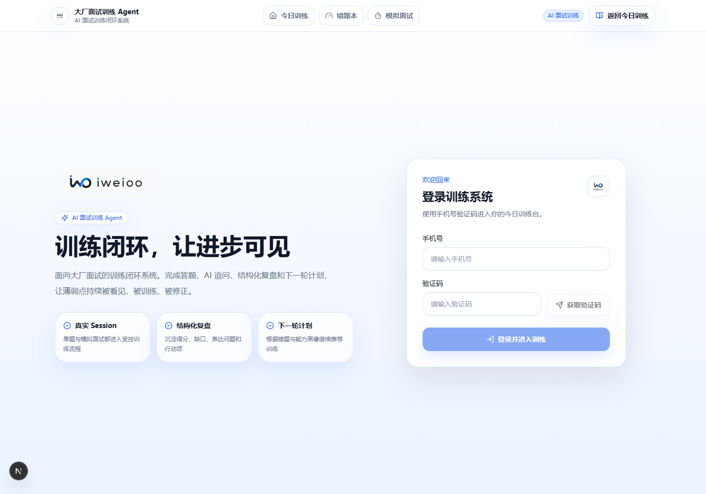
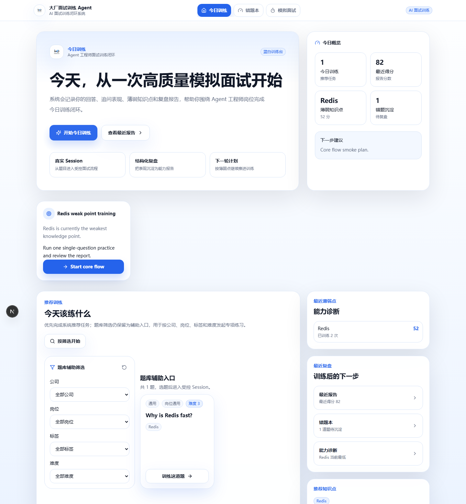
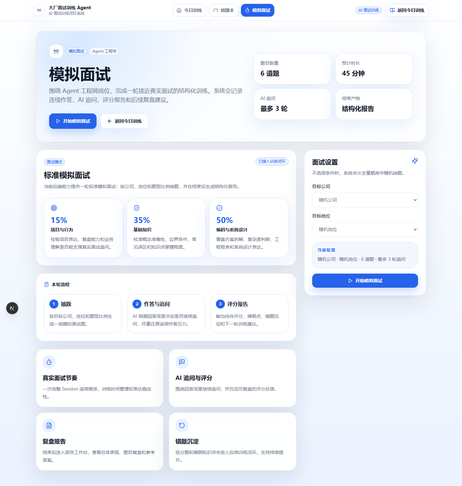
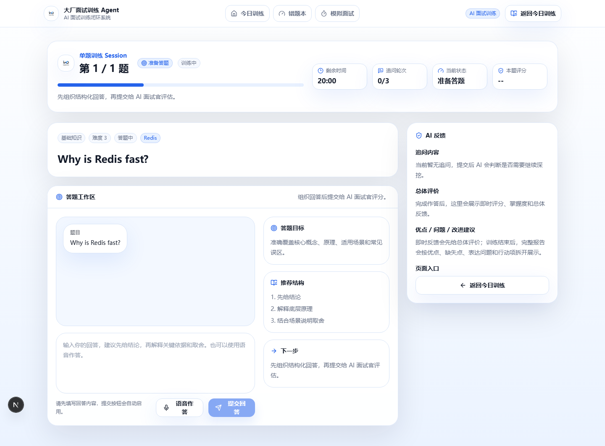
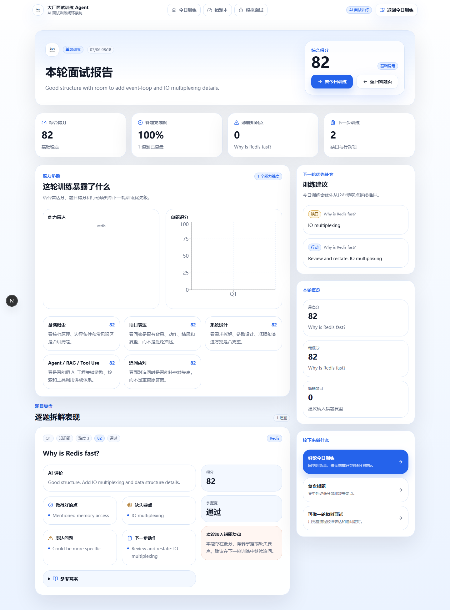
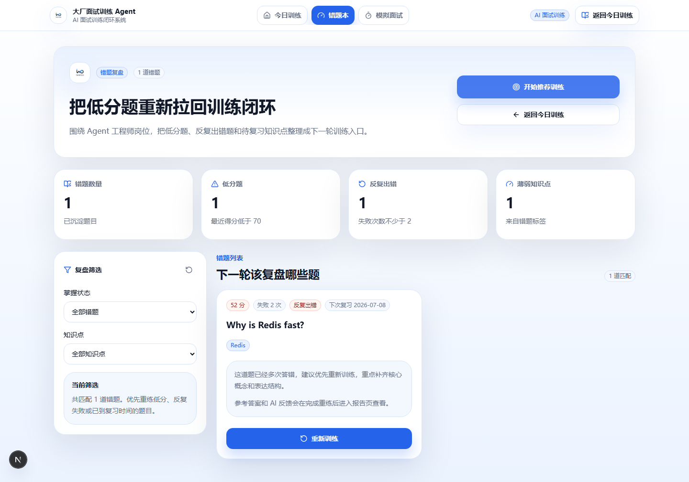
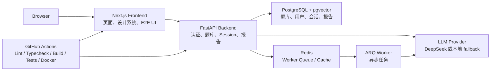

# Interview Agent

面向 Agent 工程师岗位的 AI 面试训练系统。

这个项目不是普通刷题网站，而是围绕“大厂面试训练闭环”设计的 AI 应用：用户从今日训练进入模拟面试或单题训练，在 Session 中完成作答、AI 追问和评分，结束后查看结构化报告，再把薄弱知识点和错题沉淀到下一轮训练计划中。

```text
今日训练 -> 模拟面试 / 单题训练 -> AI 追问与评分 -> 报告复盘 -> 错题沉淀 -> 下一轮训练
```

## 产品截图

截图来自 Playwright 视觉 QA，稳定资产位于 `docs/assets/product/`。

| 登录页 | 今日训练 |
| --- | --- |
|  |  |

| 模拟面试 | 答题 Session |
| --- | --- |
|  |  |

| 报告复盘 | 错题本 |
| --- | --- |
|  |  |

## 核心功能

- 登录与训练入口：手机号验证码登录；开发/测试环境可通过 `AUTH_DEV_CODE_ENABLED=true` 使用可配置开发验证码，生产环境会拒绝默认 `000000`。
- 今日训练 Dashboard：展示今日训练目标、薄弱点、错题沉淀、最近报告和推荐训练任务。
- 模拟面试：按公司和岗位筛选，创建一轮结构化模拟面试 Session。
- 答题 Session：支持单题训练和模拟面试，展示题号、状态、倒计时、作答区、评分反馈和下一步操作。
- AI 追问与评分：后端通过 LLM 抽象层生成追问和评分；未配置真实模型时使用本地 fallback 便于跑通闭环。
- 报告复盘：展示综合得分、能力诊断、题目复盘、参考答案和下一步训练建议。
- 错题本：沉淀低分题、失败次数、待复习题和重新训练入口。
- 全局导航：统一进入今日训练、错题本和模拟面试。
- 视觉 QA 与 E2E：覆盖核心链路、导航、移动端布局和截图证据。

## 技术栈

**Frontend**

- Next.js 15
- React 18
- TypeScript
- Tailwind CSS
- TanStack Query
- Playwright

**Backend**

- FastAPI
- Python
- SQLAlchemy
- Alembic
- ARQ worker
- DeepSeek LLM 抽象层
- Whisper/SenseVoice 风格音频转写接口配置

**Database / Infra**

- PostgreSQL + pgvector
- Redis
- Docker Compose

**Engineering**

- GitHub Actions CI
- Ruff
- TypeScript typecheck
- Next build
- Playwright E2E
- Visual smoke screenshots
- Secret Scan
- Docker image build check

## 架构概览



## 核心用户路径

1. 进入 `/login`，使用手机号验证码登录。
2. 登录后进入 `/practice` 今日训练 Dashboard。
3. 点击“开始今日训练”或进入 `/mock` 创建模拟面试。
4. 进入 `/session/{id}`，完成作答、提交回答并查看 AI 反馈。
5. 训练结束后进入 `/report/{id}`，查看综合表现、题目复盘和下一步建议。
6. 回到 `/practice` 继续训练，或进入 `/wrong-book` 复盘低分题。

## 本地启动

推荐使用 Docker Compose 跑完整链路：

```powershell
Copy-Item .env.example .env
docker compose -p interview-agent up --build
```

打开：

- Frontend: http://localhost:3000
- API health: http://localhost:8000/health
- API docs: http://localhost:8000/docs

默认说明：

- 未配置 `DEEPSEEK_API_KEY` 时，追问和评分使用本地 fallback，便于本地演示闭环。
- 开发/测试认证：`APP_ENV=development` 且 `AUTH_DEV_CODE_ENABLED=true` 时，登录接口返回 `AUTH_DEV_CODE`（默认 `000000`），便于本地演示。
- 生产认证边界：`APP_ENV=production` 时会拒绝默认开发验证码 `000000` 和默认 `JWT_SECRET`；当前未接入真实短信服务商，生产登录需要补齐短信验证实现。
- Token 过期时间通过 `ACCESS_TOKEN_EXPIRE_MINUTES` 配置，默认 1440 分钟。
- 未配置 `WHISPER_API_KEY` 时，文本作答不受影响；音频转写接口会返回不可用状态。

前端单独启动：

```powershell
cd frontend
npm ci
npm run dev
```

后端本地校验需要先安装后端依赖：

```powershell
cd backend
python -m pip install -r requirements-dev.txt
$env:PYTHONPATH=(Get-Location).Path
python -m compileall app tests alembic
python -m unittest discover -s tests -p "test_*.py" -v
```

## 测试与质量保障

前端：

```powershell
cd frontend
npm run lint
npm run typecheck
npm run build
npm run test:e2e
npm run test:e2e:visual
```

仓库级本地 CI：

```powershell
.\scripts\ci-local.ps1 -SkipDocker -SkipSecretScan
```

GitHub Actions 当前包含：

- Backend: `ruff check`、`compileall`、`unittest`
- Frontend: `lint`、`typecheck`、`build`、Playwright E2E
- Migrations: PostgreSQL 服务下执行 `alembic upgrade head`
- Compose Config: `docker compose config --quiet`
- Docker Build: 后端与前端镜像构建
- Secret Scan: Gitleaks
- Visual Artifact: 上传 `frontend/test-results/visual/` 截图证据

更多视觉验收标准见 [Frontend Visual QA](docs/frontend-visual-qa.md)。

## 工程亮点

- 训练闭环产品主线：今日训练、模拟面试、答题 Session、报告复盘、错题本串成完整路径。
- 蓝白品牌视觉系统：统一 Logo、导航、卡片、按钮、输入态和移动端布局。
- 前后端分离：Next.js 前端通过 API client 调用 FastAPI 后端。
- LLM 抽象层：支持真实 LLM 配置，也支持本地 fallback 保证演示和测试稳定。
- 核心链路 E2E：覆盖 practice -> session -> report -> practice、wrong-book 回流、mock 创建等路径。
- 视觉 QA：为核心页面生成桌面端和移动端截图，并检查无横向溢出。
- CI 质量门禁：代码检查、类型检查、构建、迁移、Docker 构建、E2E 和 secret scan。

## 目录结构

```text
backend/app/api        FastAPI 接口
backend/app/core       LLM、追问状态机、出题策略
backend/app/ingest     种子题导入、候选题生成与预检
backend/alembic        数据库迁移
frontend/app           Next.js App Router 页面
frontend/components    设计系统与公共组件
frontend/lib           API client、类型和前端 helper
frontend/tests/e2e     Playwright E2E 和视觉冒烟测试
docs                   产品设计、视觉验收和演示文档
```

## 主要页面

- `/login`：手机号验证码登录。
- `/practice`：今日训练 Dashboard。
- `/mock`：模拟面试入口和配置页。
- `/session/{id}`：答题、追问、评分和结束态。
- `/report/{id}`：报告复盘工作台。
- `/wrong-book`：错题复盘和重新训练。
- `/contribute`：用户投稿。
- `/admin`：题目生成和人工审核。

## 面试讲解建议

演示时优先讲“为什么这是训练闭环，而不是功能堆叠”：

1. 先展示 `/practice` 的今日训练目标和下一步 CTA。
2. 进入 `/mock`，说明完整模拟面试如何创建。
3. 进入 `/session/{id}`，说明答题状态、AI 反馈和下一步动作。
4. 打开 `/report/{id}`，讲报告如何指导下一轮训练。
5. 进入 `/wrong-book`，说明错题如何回流到训练闭环。
6. 最后展示 CI、E2E 和视觉 QA，证明项目不是只做页面，而是有工程化质量保障。

更完整的演示脚本见 [Product Demo Guide](docs/product-demo-guide.md)。

## 路线图

已完成：

- 蓝白品牌设计底座与核心页面统一。
- 今日训练、模拟面试、答题 Session、报告复盘、错题本闭环。
- 核心路径 E2E、视觉 QA 截图和 CI artifact。
- Docker Compose 本地完整链路。

计划中：

- 更完整的用户体系和训练历史。
- Agent Memory 与更细粒度能力画像。
- 多模型评分对比。
- 报告导出和分享。
- 题库管理体验增强。
- 线上部署与监控。

## License

项目代码采用 MIT License。题库中从第三方公开项目整理或改编的内容遵循 `QUESTION_SOURCES.md` 中列出的原始许可和署名要求。
