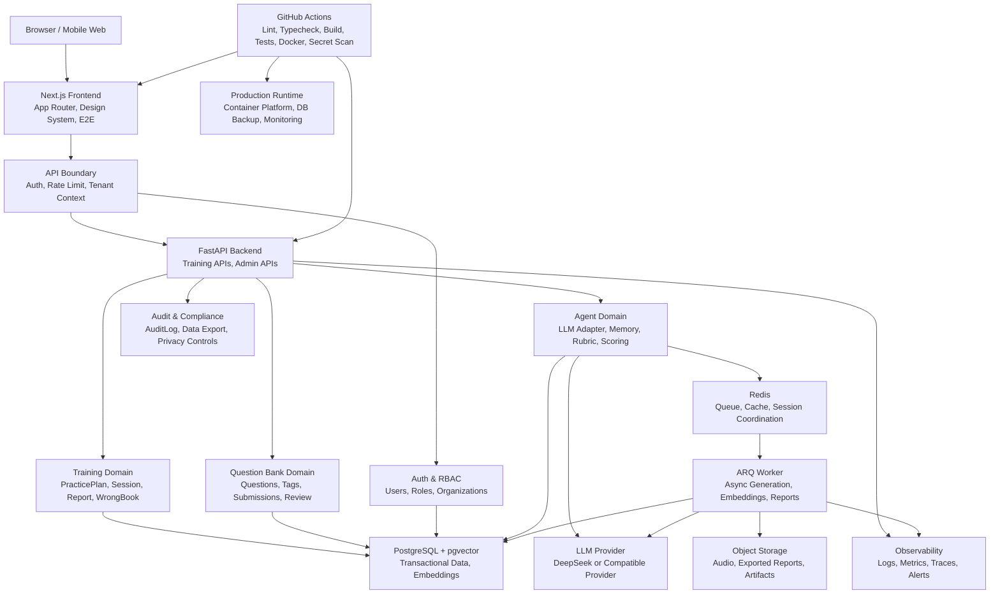

# SaaS Target Architecture

本文档基于当前代码扫描，定义 Interview Agent 从“训练闭环型产品”继续演进到企业级 SaaS 的目标架构边界。本文只做架构分析，不代表当前系统已经具备所有企业级能力。

## 当前项目定位

Interview Agent 当前已经是一个可运行的 AI 面试训练闭环：

- 前端核心页面：`/login`、`/practice`、`/mock`、`/session/{id}`、`/report/{id}`、`/wrong-book`。
- 后端核心 API：认证、题库、Session、报告、错题本、能力雷达、今日训练计划、投稿与后台审核。
- 数据闭环：`Session` -> `SessionQuestion` -> `EvaluationResult` -> `WrongBook` / `UserTagStat` / `PracticePlan`。
- 工程质量：后端 unittest、前端 lint/typecheck/build、Playwright E2E、视觉 QA 截图、GitHub Actions CI。

当前更接近“单产品多用户训练系统”，还不是完整企业级 SaaS。企业级 SaaS 需要进一步补齐租户、权限、审计、历史中心、长期记忆、Rubric 版本化、生产运维和数据隐私能力。

## 企业级 SaaS 目标形态

目标形态是一个面向个人求职者、训练营、企业内训或高校就业服务的 AI 面试训练 SaaS：

- 支持真实用户账号和用户私有数据隔离。
- 支持组织或租户维度，便于企业/班级/训练营管理成员和题库。
- 支持长期训练历史、能力画像和 Agent Memory。
- 支持可版本化评分 Rubric，保证评分可解释、可回溯。
- 支持题库运营、投稿审核、题目版本和质量治理。
- 支持分级权限、审计日志、操作追踪和安全合规。
- 支持生产部署、监控、告警、备份和恢复。

## 核心业务闭环

```text
用户登录
  -> 今日训练 / 模拟面试 / 错题复盘
  -> Session 答题
  -> AI 追问与评分
  -> EvaluationResult
  -> Report
  -> WrongBook / UserTagStat / PracticePlan
  -> 下一轮个性化训练
```

当前代码中已落地的关键闭环：

- `backend/app/api/sessions.py` 创建 Session、提交回答、生成评价、更新错题本与能力统计。
- `backend/app/api/stats.py` 提供错题本、能力雷达、最近报告列表。
- `backend/app/api/practice_plan.py` 根据错题、弱标签、最近报告和未完成 Session 生成今日计划。
- `frontend/app/practice/page.tsx`、`frontend/app/session/[id]/page.tsx`、`frontend/app/report/[id]/page.tsx`、`frontend/app/wrong-book/page.tsx` 展示训练闭环。

## 目标架构图



### Production Config Governance

PR #36 adds a settings-layer configuration governance baseline. The backend groups app, auth, dev-auth, admin, database, LLM, observability and usage-metering settings in one place, validates dangerous production defaults before startup, and logs only a sanitized `config.loaded` summary.

This is intentionally local settings governance, not an external configuration platform. Vault, Apollo, Nacos, Kubernetes ConfigMap, runtime reload and release orchestration remain out of scope for the current codebase.

### Release/CD Layer

PR #37 adds the first release/CD management layer. The repository now has a manual release candidate workflow, release management SOP, release evidence template, migration gate, Docker image tag strategy and rollback procedure.

This layer is governance only. It does not deploy production, does not require production secrets, does not introduce Kubernetes, and does not push release-candidate images to a registry. Existing CI remains the required quality gate before release candidate review.

### Staging Deployment Layer

PR #45 adds a staging deployment foundation for release-candidate rehearsal. The repository now includes `docker-compose.staging.yml`, `.env.staging.example`, `scripts/staging-smoke.ps1`, and `docs/staging-deployment.md`.

Staging is production-shaped but not production: it uses PostgreSQL, Redis, backend and frontend services, Redis-backed rate limit/cache settings, immutable image tags, health/readiness checks and smoke evidence. It does not deploy production, does not require real cloud secrets, does not introduce Kubernetes and does not hard-code personal server IPs.

### Backup and Restore Layer

PR #46 adds a PostgreSQL backup and restore foundation for local and staging. The repository now includes `scripts/backup-postgres.ps1`, `scripts/restore-postgres.ps1`, `scripts/verify-postgres-backup.ps1`, `docs/backup-and-restore.md`, and `docs/backup-evidence-template.md`.

This layer covers migration pre-backup, checksum verification, restore drills, release evidence and staging rehearsal. It does not run production backup automatically, does not upload to cloud storage, does not schedule backups, and does not commit database dump artifacts.

### Audit Layer

PR #38 adds a persistent `audit_events` ledger for selected security and admin events. Login success, login failure, admin access and admin denial are recorded with `request_id`, masked actor identity, status, reason and sanitized metadata.

This is audit foundation v1. It does not add tenant scoping, frontend admin pages, full report access audit, data export audit or privacy request workflows.

### Metrics Layer

PR #47 adds a Prometheus-compatible metrics foundation. The backend exposes `/metrics` when `METRICS_ENABLED=true` and records aggregate telemetry for HTTP traffic, request latency, exceptions, training events, rate-limit and quota refusals, LLM calls/tokens/estimated cost/latency, and dependency readiness gauges.

Metrics are designed for low-cardinality operational monitoring. Labels intentionally exclude `request_id`, `user_id`, `session_id`, phone numbers, tokens, secrets, verification codes, prompt text, completion text and user answer text. Request-level debugging still uses `X-Request-ID` and structured logs, while security reconstruction uses `audit_events`.

This layer does not add Grafana, external monitoring SaaS or OpenTelemetry tracing. Production metrics access should be protected by internal networking, a gateway allowlist or equivalent deployment controls.

### Alerting and Incident Response Layer

PR #51 adds alerting rules and incident response governance on top of the metrics foundation. The repository now includes example Prometheus alert rules, a P0/P1/P2/P3 severity model, an incident runbook, an incident evidence template and documentation links from release, staging, backup and observability docs.

This layer is still governance and rule-as-code only. It does not deploy Prometheus, does not add Grafana, does not integrate external alerting services, and does not page operators automatically. The rules intentionally use existing low-cardinality metrics and leave unsupported future signals as TODOs.

### Abuse Protection and Quota Layer

PR #39 adds rate limit and quota foundation v1. Auth endpoints are protected by IP and phone buckets, answer submission is protected by user/session buckets, and LLM scoring checks user-scoped token/call quotas against `llm_usage_records` before model evaluation.

PR #44 upgrades this layer to a configurable rate-limit backend. Local/test can keep memory buckets, while staging/production should use Redis-backed counters with TTL so multiple backend instances share auth and answer-submit limits. Production fail-fast validation rejects the memory backend when rate limiting is enabled.

Quota is still cost-control metadata, not payment, subscription, billing, or commercial plan enforcement. The Redis foundation does not add an external gateway, distributed locks, task queues or Agent Memory.

### Redis-Backed Rate Limit and Cache Foundation

PR #44 adds a shared infrastructure foundation:

- `RATE_LIMIT_BACKEND=memory|redis`
- Redis-backed counters using `INCR`, `EXPIRE` and `TTL`
- hashed Redis limiter keys so raw phone numbers and tokens are not stored in keys
- `CACHE_BACKEND=memory|redis` as a foundation switch only
- `/ready` Redis checks when Redis-backed rate limit or cache is enabled

This is the minimum multi-instance safety baseline for request throttling. A future gateway limiter or Redis Lua/token-bucket implementation can replace the fixed-window v1 without changing the API-level abuse-protection contract.

### RBAC Layer

PR #40 adds RBAC foundation v1. `users.role` supports `user`, `admin`, and `content_operator`. Admin routes authorize `role=admin` first and keep `ADMIN_PHONES` as a bootstrap/fallback path. `content_operator` is reserved for future content workflows and cannot access admin-only routes in v1.

This is not an organization or tenant model. It does not include resource-level permissions, a full permission matrix, role management UI, or frontend admin user management.

### Question Bank Management Layer

PR #41 adds question bank management backend v1. The system reuses the existing `questions`, `question_tags`, `tags`, `companies`, and `positions` tables instead of creating a parallel question model. Management metadata is added to `questions`: creator, updater, updated time, published time and archived time.

`admin` and `content_operator` can create, update, publish, archive and query managed questions through `/api/admin/questions`. Ordinary `/api/questions` and training session selection only expose published questions. Legacy `active` questions remain readable and trainable for seed-data compatibility.

This layer does not add a frontend admin page, organization/tenant scoping, complex permission matrices, bulk operations, or question version diffing.

### Scoring Rubric Versioning Layer

PR #42 adds scoring rubric versioning backend v1. The data model introduces `scoring_rubrics` and `scoring_rubric_versions`, and `questions.default_rubric_version_id` can point at a published rubric version for future scoring. New `evaluation_results` rows store the actual `rubric_version_id` used by scoring, and generated report question payloads include the same id so historical reports remain traceable after later rubric changes.

`admin` and `content_operator` can manage rubrics and rubric versions through `/api/admin/rubrics` and `/api/admin/rubric-versions`. Ordinary users cannot write rubric data. If a question points at an archived rubric version, new scoring falls back to `system_default` rubric v1 instead of using the archived version.

This layer does not add a frontend admin page, Agent Memory, a complex scoring engine rewrite, rubric replay, rubric diffing, or production-grade rollout controls.

### Admin Console Layer

PR #43 adds Admin Console v1 on the frontend. The routes `/admin`, `/admin/questions`, and `/admin/rubrics` expose the existing backend question-bank and rubric APIs to `admin` and `content_operator` users. The console supports question list filtering, question creation/editing, publishing, archiving, rubric creation, rubric-version creation, publishing and archiving.

The frontend does not become the source of truth for permissions. It treats backend 403 responses as the authority and shows a forbidden state for ordinary users. This layer does not add user management, organization/tenant management, billing, Agent Memory, or a complex permission matrix.

## 前端架构

当前已完成：

- Next.js App Router 页面结构位于 `frontend/app`。
- 公共 UI 和品牌组件位于 `frontend/components/ui.tsx`、`frontend/components/app-header.tsx`。
- API client 位于 `frontend/lib/api-client.ts`，统一注入 `Authorization: Bearer ...`。
- 核心页面已统一蓝白品牌视觉，并有 Playwright E2E 与 visual smoke 覆盖。

目标形态：

- 引入更明确的功能模块边界，例如 `features/practice`、`features/session`、`features/report`、`features/admin`。
- 增加训练历史中心、个人画像中心、组织管理、权限感知导航。
- 对企业 SaaS 页面增加角色态：普通用户、教练/管理员、内容审核员。
- 在前端错误处理层增加 request id、trace id 展示，便于排障。

## 后端架构

当前已完成：

- FastAPI 路由拆分：`auth`、`questions`、`sessions`、`stats`、`practice_plan`、`submissions`、`admin`、`audio`。
- `get_current_user` 解析 Bearer token 并通过手机号创建或读取用户。
- `require_admin` 基于 `users.role=admin` 保护 `/admin` 路由，并保留 `ADMIN_PHONES` 作为 bootstrap/fallback。
- Session API 按 `Session.user_id == current_user.id` 做读取和提交隔离。
- WrongBook、UserTagStat、PracticePlan 均按 `user_id` 存储或查询。

目标形态：

- 将当前路由内领域逻辑逐步抽到 service 层，例如 `SessionService`、`ReportService`、`PracticePlanService`。
- 引入组织/租户上下文，API 查询统一带 `tenant_id` 或 `organization_id`。
- 在 request id 基础上继续扩展审计事件覆盖范围。
- 增加 rate limit、幂等键、后台任务状态查询。
- 将 LLM 调用、评分、报告生成等长耗时能力异步化。

## 数据层架构

当前已完成：

- `users`、`sessions`、`session_questions`、`messages`、`evaluation_results`、`wrong_book`、`user_tag_stats`、`practice_plans` 等核心训练表。
- `questions`、`question_tags`、`companies`、`positions`、`tags` 支撑题库。
- `question_submissions` 支撑投稿与审核。
- `EvaluationResult` 已保存 `model_name`、`prompt_version`、`rubric_version_id` 和结构化反馈字段。
- `scoring_rubrics` and `scoring_rubric_versions` support rubric versioning for new scoring results.
- PostgreSQL + pgvector 在 Docker Compose 和 migration 中配置。

目标形态：

- 增加 `organizations`、`memberships`、`roles`、`permissions`。
- 所有用户私有数据增加租户维度，形成 `tenant_id + user_id` 双层隔离。
- 增加 `training_history` 或以查询视图聚合 Session、Report、WrongBook、PracticePlan。
- 增加 `agent_memories`、`memory_events`、`ability_profiles`。
- Enhance rubric versioning with replay, diff, rollout, gray release and frontend administration.
- 扩展 `audit_events` 覆盖报告访问、题库审核、数据导出和隐私请求；增加 `data_exports`、`privacy_requests`。
- 增加备份、恢复、归档和数据保留策略。

## Agent 能力架构

当前已完成：

- `backend/app/core/interviewer.py` 提供追问和评分引擎。
- `backend/app/core/llm.py` 提供 DeepSeek LLM 和本地 MockLLM/fallback。
- `EvaluationResult` 沉淀分数、掌握度、优点、缺失点、表达问题、行动项、模型名、prompt 版本和 rubric version。
- PracticePlan 会使用错题、弱标签和最近报告行动项生成下一步任务。

目标形态：

- Agent Memory：按用户长期保存薄弱点、表达习惯、项目经历、目标岗位偏好。
- Rubric 引擎：评分标准从 prompt 中抽离，版本化、可灰度、可审计。
- 多模型评估：支持模型对比、裁判模型、成本统计和质量回放。
- 个性化训练：PracticePlan 不只看最近一次结果，而是基于长期能力曲线。
- Agent 工具链：题库检索、历史报告检索、错题检索、能力画像检索形成 Tool Use。

## 测试与 CI 架构

当前已完成：

- 后端单元测试和 API 合同测试位于 `backend/tests`。
- 前端 E2E 位于 `frontend/tests/e2e`，覆盖核心训练链路、导航、mock 创建、视觉截图。
- 本地 CI 脚本 `scripts/ci-local.ps1` 覆盖后端 lint/compile/unit、前端 lint/typecheck/build/e2e、Compose config。
- GitHub Actions 覆盖 Backend、Frontend、Migrations、Compose Config、Docker Build、Secret Scan。
- 生产可观测性基础版已覆盖 `X-Request-ID`、结构化请求日志、统一 500 响应、`/health`、`/ready` 和关键业务事件日志。

目标形态：

- 增加权限隔离测试：用户 A 不能访问用户 B 的 Session/Report/WrongBook。
- 增加多租户测试：租户 A 不能访问租户 B 的数据和题库。
- 增加 Rubric 版本兼容测试。
- 增加审计日志测试。
- 增加 metrics、trace propagation 和告警规则测试。
- 增加迁移回滚/备份恢复演练。
- 增加生产构建部署 smoke test。

## 部署与运维架构

当前已完成：

- Docker Compose 本地完整链路：frontend、api、worker、postgres、redis。
- CI 做 Docker image build check。
- 后端已有 `/health` 和 `/ready`，请求日志包含 `request_id`、method、path、status、duration，500 响应包含 `request_id`。
- 当前仓库没有生产环境部署清单、域名、TLS、外部监控、备份或恢复脚本。

目标形态：

- 生产环境容器平台：云服务、Kubernetes、ECS、Fly.io、Render 或类似平台。
- 托管 PostgreSQL、托管 Redis、对象存储。
- TLS、域名、CORS、环境变量和密钥管理。
- 指标、链路追踪、日志采集和告警平台。
- 数据库备份、恢复演练和迁移策略。
- 灰度发布和回滚机制。

## 安全与权限架构

当前已完成：

- Bearer token 认证。
- 开发验证码已通过 `APP_ENV`、`AUTH_DEV_CODE_ENABLED`、`AUTH_DEV_CODE` 配置隔离；生产环境会拒绝默认 `000000` 和默认 `JWT_SECRET`。
- 管理接口通过 `require_admin` 和 `users.role=admin` 限制，`ADMIN_PHONES` 仅作为 bootstrap/fallback。
- 用户训练数据大多通过 `user_id` 过滤。
- CI 有 Secret Scan。

当前不足：

- Token 是自定义 HMAC 格式，不是标准 JWT 库实现。
- 真实短信服务商、验证码存储、过期校验、错误次数限制和重放保护仍未接入。
- 没有 refresh token、设备管理和会话撤销；登录审计已有 v1 但仍缺验证码生命周期和设备维度。
- RBAC v1 只有单一 `users.role` 字段，没有多角色表或复杂权限矩阵。
- 没有租户隔离、资源级 RBAC、完整资源审计、数据导出/删除、隐私合规流程。

目标形态：

- 标准认证方案：JWT/OIDC、refresh token、过期和撤销机制。
- RBAC/ABAC：用户、组织、角色、权限、资源范围。
- 审计：记录登录、管理操作、题库审核、报告访问、数据导出。
- 隐私：数据最小化、导出、删除、脱敏、保留期限。
- 防护：rate limit、CSRF 视场景而定、CORS 收紧、输入大小限制、文件上传安全。
## AI FinOps / Usage Ledger v1

PR #35 adds the minimum AI FinOps foundation to the target architecture. The scope is internal metering only: no payments, no plans and no quota deduction.

Completed in v1:

- Added `llm_usage_records`, scoped by `user_id`.
- Records `provider`, `model`, `feature`, token counts, `estimated_cost`, `pricing_version`, `latency_ms`, `status`, `request_id` and `session_id`.
- `GET /api/me/usage/summary` returns only the current user's totals, current-month totals, feature breakdown, model breakdown and recent records.
- The usage ledger does not store prompts, completions, answer text, tokens, secrets or verification codes.

Target state:

- The ledger can later support plans, quota checks, model cost dashboards, quality/cost comparison and abnormal usage alerts.
- Enterprise usage still needs tenant-level aggregation, quota policy, real billing and audit logs. PR #35 does not include those capabilities.

## PR #47 Update: Monitoring Metrics Endpoint and Prometheus Foundation

PR #47 completes the first metrics layer in the target architecture.

Completed in v1:

- Added a Prometheus-compatible `/metrics` endpoint controlled by `METRICS_ENABLED` and `METRICS_PATH`.
- Added HTTP request count, request duration and exception metrics with normalized route labels.
- Added training event metrics for session creation, answer submission and report generation.
- Added rate-limit and quota refusal counters.
- Added LLM call, token, estimated-cost and latency metrics from the same path that writes `llm_usage_records`.
- Added database and Redis readiness gauges updated by `/ready`.
- Added label-safety tests so metrics do not expose `request_id`, `user_id`, `session_id`, phone numbers, tokens, secrets, prompts, completions or answer text.

Still out of scope:

- No Grafana dashboard.
- No alert rules.
- No external monitoring SaaS.
- No OpenTelemetry tracing.
- No public production metrics exposure.

## PR #48 Update: Agent Memory v1 Backend Foundation

PR #48 adds the first backend Agent Memory layer to the target architecture.

Completed in v1:

- Added `agent_memories`, scoped by `user_id`, for long-term training signals.
- Added memory types for `weakness`, `strength`, `preference`, `training_goal`, `recurring_issue` and `recommendation`.
- Added current-user APIs for listing, archiving and manually refreshing memories.
- Refreshes memories from existing reports, wrong-book records and tag statistics with deterministic rules.
- Connects report completion to best-effort memory refresh after the main report transaction is committed.
- Feeds active weakness and recurring-issue memories into PracticePlan as a lightweight recommendation signal.
- Adds audit events for memory creation, update and archive.
- Adds aggregate memory metrics without high-cardinality or sensitive labels.
- Keeps raw answers, prompts, completions, tokens, secrets, verification codes and full phone numbers out of memory records.

Still out of scope:

- No vector database.
- No RAG memory retrieval.
- No Multi-Agent memory workflow.
- No LLM-based memory extraction or summarization.
- No frontend memory workbench.
- No tenant-level memory governance.

Target-state implications:

- Future personalization can combine Agent Memory with ability profiles and training history.
- A later memory extraction PR can introduce LLM summarization only after privacy, evaluation and retention rules are designed.
- Vector/RAG memory should remain separate from this relational memory ledger and must preserve user or tenant boundaries.

## PR #49 Update: LLM Gateway and Model Router v1

PR #49 adds the first backend LLM Gateway layer.

Completed in v1:

- Added a gateway module with provider abstraction for `mock`, `deepseek` and an OpenAI-compatible shape.
- Added feature-based routing for `interview_scoring`, `report_generation`, `memory_refresh`, `rubric_validation` and `admin_operation`.
- Added primary/fallback model route policy through settings.
- Added bounded timeout/retry configuration.
- Migrated the interview scoring path to the gateway while keeping the existing answer/session/report business flow intact.
- Records primary/fallback attempts through the existing `llm_usage_records` ledger and Prometheus LLM metrics.
- Keeps prompt text, completion text, answer text and API keys out of records and logs.

Still out of scope:

- No frontend model management console.
- No tenant-specific routing policy.
- No external LLM gateway service.
- No database-backed model registry.
- No canary, A/B testing or cost-aware routing yet.

Target-state implications:

- Future model governance can move from environment-variable routes to a managed model registry.
- Tenant-specific model policy should wait until organization boundaries exist.
- Cost-aware routing can build on `llm_usage_records` and Gateway attempt telemetry.

## PR #50 Update: Async Job Queue Foundation

PR #50 adds the first asynchronous worker layer to the target architecture.

Completed in v1:

- Added `async_jobs` as a durable job ledger scoped by `user_id`.
- Added job states: `queued`, `running`, `succeeded`, `failed` and `canceled`.
- Added a configurable queue backend with memory for local/test and Redis for staging/production.
- Added `python -m app.worker` as the lightweight worker entrypoint.
- Added current-user job APIs: `GET /api/me/jobs` and `GET /api/me/jobs/{job_id}`.
- Added `POST /api/me/memories/refresh-async` for async Agent Memory refresh.
- Added aggregate async job metrics and audit events.
- Added Docker Compose worker services for local and staging.
- Kept job payloads free of raw answers, prompts, completions, tokens and secrets.

Still out of scope:

- No Celery.
- No workflow engine.
- No WebSocket status push.
- No frontend task center.
- No distributed lock or delayed queue.
- No tenant-specific job policy.

Target-state implications:

- Long-running AI operations now have a place to move out of synchronous request paths.
- Future report generation, question import and rubric validation can reuse the same job ledger and worker.
- Production multi-instance deployments should use `ASYNC_JOB_BACKEND=redis`.

## PR #51 Update: Alerting Rules and Incident Runbook

PR #51 turns the existing observability signals into an operational response baseline.

Completed:

- Added example Prometheus alert rules at `observability/prometheus/alerts/interview-agent-alerts.yml`.
- Added alert severity and evidence guidance in `docs/alerting.md`.
- Added triage and recovery procedures in `docs/incident-runbook.md`.
- Added `docs/incident-evidence-template.md` for incident records.
- Added `scripts/check-alert-rules.ps1` for lightweight local rule-file validation without requiring Prometheus.
- Updated staging, release, backup, metrics, observability and README documentation to connect alerts, release freezes, backup evidence and rollback decisions.

Out of scope:

- No external alerting service integration.
- No Grafana.
- No production Prometheus deployment.
- No business logic or frontend UI changes.

## PR #52 Update: Privacy and Data Lifecycle v1

PR #52 adds the first privacy and data lifecycle layer to the target architecture.

Completed in v1:

- Added current-user data summary through `GET /api/me/data-summary`.
- Added current-user JSON export through `GET /api/me/data-export`.
- Added deletion request and confirmation through `POST /api/me/data-deletion-request` and `POST /api/me/data-delete-confirm`.
- Scoped export and deletion strictly by `current_user.id`.
- Deletes current-user training data including sessions, evaluations, reports, wrong-book records, tag stats, practice plans, Agent Memory, async jobs and LLM usage records.
- Retains the user account row, audit events, question bank, rubrics and shared content data.
- Redacts raw answers, prompts, completions, full phone numbers, tokens, secrets, verification codes and raw model output from exports.
- Adds audit events and aggregate metrics for export and deletion operations.
- Documents backup residue, Memory lifecycle, Async Job lifecycle and beta privacy checklist.

Still out of scope:

- No full GDPR/DSR workflow.
- No account closure or login blocking for deleted accounts.
- No frontend privacy center.
- No automatic retention jobs.
- No production backup purge automation.
- No organization or tenant-level privacy controls.

Target-state implications:

- The product now has a baseline current-user data rights story before small real-user trials.
- Production privacy maturity still needs account closure, automated retention, encrypted export delivery, tenant-level governance and backup purge evidence.

## PR #53 Update: Public Beta Readiness Checklist

PR #53 adds a release and operations gate for a small invited beta.

Completed in v1:

- Added `docs/public-beta-readiness.md` with admission criteria, forbidden items, operations SOP, exit criteria and Go / No-Go checklist.
- Added `docs/public-beta-evidence-template.md` for beta environment, release, smoke, backup, alert, privacy, LLM and cost evidence.
- Added `scripts/beta-readiness-check.ps1` for local readiness checks against required docs, scripts and staging env placeholders.
- Connected release, staging, privacy and incident documents to the beta checklist.
- Explicitly separates local, test, staging, beta and production.

Still out of scope:

- No real production deployment.
- No payment or subscription launch.
- No external alerting integration.
- No enterprise tenancy.
- No formal compliance certification.
- No automated production operations.

Target-state implications:

- The project now has a practical gate for a 5 to 10 user trial.
- Moving beyond beta still requires production deployment, external monitoring/alerting, retention automation, tenant governance and product support workflows.

## PR #54 Update: Real Staging Deployment Drill

PR #54 turns the staging deployment foundation into a repeatable real-server drill.

Completed in v1:

- Added `docs/staging-deployment-drill.md` for a VPS/cloud staging exercise covering checkout, env prep, Compose, migration, health, readiness, smoke, metrics, backup, restore safety, privacy, LLM Gateway, worker and incident evidence.
- Added `docs/staging-deployment-drill-evidence-template.md` for operator evidence.
- Added `scripts/staging-deployment-drill.ps1` for CI-safe static checks and optional live checks when URLs are provided.
- Connected public beta readiness, release management, staging deployment, backup and incident docs to the drill gate.

Still out of scope:

- No real production deploy.
- No committed server IP, domain or secret.
- No CI access to a real staging host.
- No automated restore against active staging data.

## PR #55 Update: Evaluation Harness and Model Comparison v1

PR #55 adds an offline quality gate for model-routing and scoring changes.

Completed in v1:

- Added `backend/app/evaluation_harness.py` for dataset loading, mock eval execution, summary calculation and baseline/candidate comparison.
- Added `backend/app/eval_runner.py` and `scripts/run-eval.ps1` for offline eval CLI usage.
- Added a sanitized smoke dataset under `evals/datasets/`.
- Connected eval documentation to LLM Gateway, metrics, staging drill and public beta readiness.
- Added local CI mock eval smoke without external LLM calls.

Still out of scope:

- No online A/B testing.
- No model-management frontend.
- No real provider eval in default CI.
- No storage of prompt text, completion text or real user answer text in eval reports.
