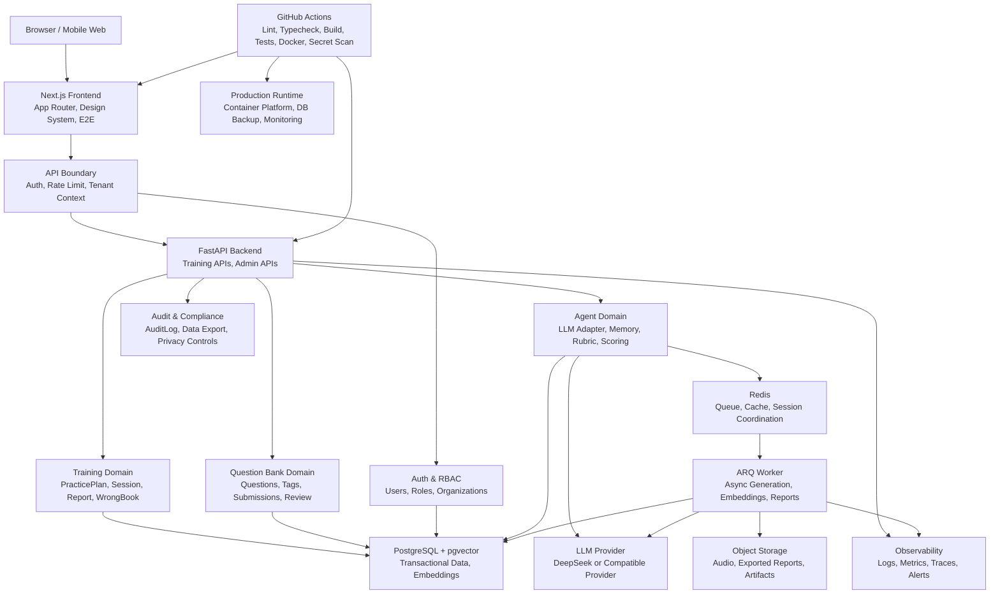

# SaaS Target Architecture

本文档基于当前代码扫描，定义 Interview Agent 从“训练闭环型产品”继续演进到企业级 SaaS 的目标架构边界。本文只做架构分析，不代表当前系统已经具备所有企业级能力。

## 当前项目定位

Interview Agent 当前已经是一个可运行的 AI 面试训练闭环：

- 前端核心页面：`/login`、`/practice`、`/mock`、`/session/{id}`、`/report/{id}`、`/wrong-book`。
- 后端核心 API：认证、题库、Session、报告、错题本、能力雷达、今日训练计划、投稿与后台审核。
- 数据闭环：`Session` -> `SessionQuestion` -> `EvaluationResult` -> `WrongBook` / `UserTagStat` / `PracticePlan`。
- 工程质量：后端 unittest、前端 lint/typecheck/build、Playwright E2E、视觉 QA 截图、GitHub Actions CI。

当前更接近“单产品多用户训练系统”，还不是完整企业级 SaaS。企业级 SaaS 需要进一步补齐租户、权限、审计、历史中心、长期记忆、Rubric 版本化、生产运维和数据隐私能力。

## 企业级 SaaS 目标形态

目标形态是一个面向个人求职者、训练营、企业内训或高校就业服务的 AI 面试训练 SaaS：

- 支持真实用户账号和用户私有数据隔离。
- 支持组织或租户维度，便于企业/班级/训练营管理成员和题库。
- 支持长期训练历史、能力画像和 Agent Memory。
- 支持可版本化评分 Rubric，保证评分可解释、可回溯。
- 支持题库运营、投稿审核、题目版本和质量治理。
- 支持分级权限、审计日志、操作追踪和安全合规。
- 支持生产部署、监控、告警、备份和恢复。

## 核心业务闭环

```text
用户登录
  -> 今日训练 / 模拟面试 / 错题复盘
  -> Session 答题
  -> AI 追问与评分
  -> EvaluationResult
  -> Report
  -> WrongBook / UserTagStat / PracticePlan
  -> 下一轮个性化训练
```

当前代码中已落地的关键闭环：

- `backend/app/api/sessions.py` 创建 Session、提交回答、生成评价、更新错题本与能力统计。
- `backend/app/api/stats.py` 提供错题本、能力雷达、最近报告列表。
- `backend/app/api/practice_plan.py` 根据错题、弱标签、最近报告和未完成 Session 生成今日计划。
- `frontend/app/practice/page.tsx`、`frontend/app/session/[id]/page.tsx`、`frontend/app/report/[id]/page.tsx`、`frontend/app/wrong-book/page.tsx` 展示训练闭环。

## 目标架构图



### Production Config Governance

PR #36 adds a settings-layer configuration governance baseline. The backend groups app, auth, dev-auth, admin, database, LLM, observability and usage-metering settings in one place, validates dangerous production defaults before startup, and logs only a sanitized `config.loaded` summary.

This is intentionally local settings governance, not an external configuration platform. Vault, Apollo, Nacos, Kubernetes ConfigMap, runtime reload and release orchestration remain out of scope for the current codebase.

### Release/CD Layer

PR #37 adds the first release/CD management layer. The repository now has a manual release candidate workflow, release management SOP, release evidence template, migration gate, Docker image tag strategy and rollback procedure.

This layer is governance only. It does not deploy production, does not require production secrets, does not introduce Kubernetes, and does not push release-candidate images to a registry. Existing CI remains the required quality gate before release candidate review.

### Audit Layer

PR #38 adds a persistent `audit_events` ledger for selected security and admin events. Login success, login failure, admin access and admin denial are recorded with `request_id`, masked actor identity, status, reason and sanitized metadata.

This is audit foundation v1. It does not add RBAC, tenant scoping, frontend admin pages, full report access audit, data export audit or privacy request workflows.

## 前端架构

当前已完成：

- Next.js App Router 页面结构位于 `frontend/app`。
- 公共 UI 和品牌组件位于 `frontend/components/ui.tsx`、`frontend/components/app-header.tsx`。
- API client 位于 `frontend/lib/api-client.ts`，统一注入 `Authorization: Bearer ...`。
- 核心页面已统一蓝白品牌视觉，并有 Playwright E2E 与 visual smoke 覆盖。

目标形态：

- 引入更明确的功能模块边界，例如 `features/practice`、`features/session`、`features/report`、`features/admin`。
- 增加训练历史中心、个人画像中心、组织管理、权限感知导航。
- 对企业 SaaS 页面增加角色态：普通用户、教练/管理员、内容审核员。
- 在前端错误处理层增加 request id、trace id 展示，便于排障。

## 后端架构

当前已完成：

- FastAPI 路由拆分：`auth`、`questions`、`sessions`、`stats`、`practice_plan`、`submissions`、`admin`、`audio`。
- `get_current_user` 解析 Bearer token 并通过手机号创建或读取用户。
- `require_admin` 基于 `ADMIN_PHONES` 保护 `/admin` 路由。
- Session API 按 `Session.user_id == current_user.id` 做读取和提交隔离。
- WrongBook、UserTagStat、PracticePlan 均按 `user_id` 存储或查询。

目标形态：

- 将当前路由内领域逻辑逐步抽到 service 层，例如 `SessionService`、`ReportService`、`PracticePlanService`。
- 引入组织/租户上下文，API 查询统一带 `tenant_id` 或 `organization_id`。
- 在 request id 基础上继续扩展审计事件覆盖范围。
- 增加 rate limit、幂等键、后台任务状态查询。
- 将 LLM 调用、评分、报告生成等长耗时能力异步化。

## 数据层架构

当前已完成：

- `users`、`sessions`、`session_questions`、`messages`、`evaluation_results`、`wrong_book`、`user_tag_stats`、`practice_plans` 等核心训练表。
- `questions`、`question_tags`、`companies`、`positions`、`tags` 支撑题库。
- `question_submissions` 支撑投稿与审核。
- `EvaluationResult` 已保存 `model_name`、`prompt_version` 和结构化反馈字段。
- PostgreSQL + pgvector 在 Docker Compose 和 migration 中配置。

目标形态：

- 增加 `organizations`、`memberships`、`roles`、`permissions`。
- 所有用户私有数据增加租户维度，形成 `tenant_id + user_id` 双层隔离。
- 增加 `training_history` 或以查询视图聚合 Session、Report、WrongBook、PracticePlan。
- 增加 `agent_memories`、`memory_events`、`ability_profiles`。
- 增加 `scoring_rubrics`、`rubric_versions`，让评分体系可版本化。
- 扩展 `audit_events` 覆盖报告访问、题库审核、数据导出和隐私请求；增加 `data_exports`、`privacy_requests`。
- 增加备份、恢复、归档和数据保留策略。

## Agent 能力架构

当前已完成：

- `backend/app/core/interviewer.py` 提供追问和评分引擎。
- `backend/app/core/llm.py` 提供 DeepSeek LLM 和本地 MockLLM/fallback。
- `EvaluationResult` 沉淀分数、掌握度、优点、缺失点、表达问题、行动项、模型名和 prompt 版本。
- PracticePlan 会使用错题、弱标签和最近报告行动项生成下一步任务。

目标形态：

- Agent Memory：按用户长期保存薄弱点、表达习惯、项目经历、目标岗位偏好。
- Rubric 引擎：评分标准从 prompt 中抽离，版本化、可灰度、可审计。
- 多模型评估：支持模型对比、裁判模型、成本统计和质量回放。
- 个性化训练：PracticePlan 不只看最近一次结果，而是基于长期能力曲线。
- Agent 工具链：题库检索、历史报告检索、错题检索、能力画像检索形成 Tool Use。

## 测试与 CI 架构

当前已完成：

- 后端单元测试和 API 合同测试位于 `backend/tests`。
- 前端 E2E 位于 `frontend/tests/e2e`，覆盖核心训练链路、导航、mock 创建、视觉截图。
- 本地 CI 脚本 `scripts/ci-local.ps1` 覆盖后端 lint/compile/unit、前端 lint/typecheck/build/e2e、Compose config。
- GitHub Actions 覆盖 Backend、Frontend、Migrations、Compose Config、Docker Build、Secret Scan。
- 生产可观测性基础版已覆盖 `X-Request-ID`、结构化请求日志、统一 500 响应、`/health`、`/ready` 和关键业务事件日志。

目标形态：

- 增加权限隔离测试：用户 A 不能访问用户 B 的 Session/Report/WrongBook。
- 增加多租户测试：租户 A 不能访问租户 B 的数据和题库。
- 增加 Rubric 版本兼容测试。
- 增加审计日志测试。
- 增加 metrics、trace propagation 和告警规则测试。
- 增加迁移回滚/备份恢复演练。
- 增加生产构建部署 smoke test。

## 部署与运维架构

当前已完成：

- Docker Compose 本地完整链路：frontend、api、worker、postgres、redis。
- CI 做 Docker image build check。
- 后端已有 `/health` 和 `/ready`，请求日志包含 `request_id`、method、path、status、duration，500 响应包含 `request_id`。
- 当前仓库没有生产环境部署清单、域名、TLS、外部监控、备份或恢复脚本。

目标形态：

- 生产环境容器平台：云服务、Kubernetes、ECS、Fly.io、Render 或类似平台。
- 托管 PostgreSQL、托管 Redis、对象存储。
- TLS、域名、CORS、环境变量和密钥管理。
- 指标、链路追踪、日志采集和告警平台。
- 数据库备份、恢复演练和迁移策略。
- 灰度发布和回滚机制。

## 安全与权限架构

当前已完成：

- Bearer token 认证。
- 开发验证码已通过 `APP_ENV`、`AUTH_DEV_CODE_ENABLED`、`AUTH_DEV_CODE` 配置隔离；生产环境会拒绝默认 `000000` 和默认 `JWT_SECRET`。
- 管理接口通过 `require_admin` 和 `ADMIN_PHONES` 限制。
- 用户训练数据大多通过 `user_id` 过滤。
- CI 有 Secret Scan。

当前不足：

- Token 是自定义 HMAC 格式，不是标准 JWT 库实现。
- 真实短信服务商、验证码存储、过期校验、错误次数限制和重放保护仍未接入。
- 没有 refresh token、设备管理和会话撤销；登录审计已有 v1 但仍缺验证码生命周期和设备维度。
- 权限模型只有 admin phone allowlist，没有角色/权限表。
- 没有租户隔离、完整 RBAC、完整资源审计、数据导出/删除、隐私合规流程。

目标形态：

- 标准认证方案：JWT/OIDC、refresh token、过期和撤销机制。
- RBAC/ABAC：用户、组织、角色、权限、资源范围。
- 审计：记录登录、管理操作、题库审核、报告访问、数据导出。
- 隐私：数据最小化、导出、删除、脱敏、保留期限。
- 防护：rate limit、CSRF 视场景而定、CORS 收紧、输入大小限制、文件上传安全。
## AI FinOps / Usage Ledger v1

PR #35 adds the minimum AI FinOps foundation to the target architecture. The scope is internal metering only: no payments, no plans and no quota deduction.

Completed in v1:

- Added `llm_usage_records`, scoped by `user_id`.
- Records `provider`, `model`, `feature`, token counts, `estimated_cost`, `pricing_version`, `latency_ms`, `status`, `request_id` and `session_id`.
- `GET /api/me/usage/summary` returns only the current user's totals, current-month totals, feature breakdown, model breakdown and recent records.
- The usage ledger does not store prompts, completions, answer text, tokens, secrets or verification codes.

Target state:

- The ledger can later support plans, quota checks, model cost dashboards, quality/cost comparison and abnormal usage alerts.
- Enterprise usage still needs tenant-level aggregation, quota policy, real billing and audit logs. PR #35 does not include those capabilities.
